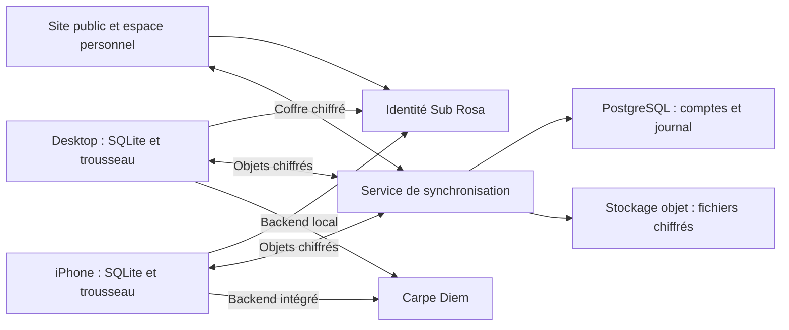

# Sub Rosa : comptes, synchronisation et site

Date : 14 septembre 2026. Statut : conception initiale, suivie d’une implémentation en cours de validation.

Les notes ci-dessous évaluent la conception, pas une certification du logiciel.
Les décisions effectivement implémentées et leurs écarts sont consignés dans
[ADR-0049](adr/0049-accounts-synchronise-ciphertext-without-hosting-inference.md),
[ADR-0050](adr/0050-vault-admission-uses-an-out-of-band-secret.md) et le
[contrat](accounts-sync-contract.md). L’ouverture de comptes en production reste
conditionnée à l’hébergement, au fournisseur d’identité et aux validations externes.

## Recommandation

Créer un **compte Sub Rosa**, commun au site, au desktop et à l’iPhone, avec une synchronisation chiffrée de bout en bout. L’utilisateur configure Carpe Diem une seule fois ; ses appareils autorisés récupèrent la configuration sans nouvelle saisie. Les applications continuent à travailler localement et à joindre Carpe Diem directement, avec le sidecar actuel.

Le nouveau service héberge l’identité, les autorisations d’appareils et les données chiffrées. Il n’a pas besoin de connaître la clé Carpe Diem ni le contenu des notes. Le site propose les téléchargements, la création de compte, les réglages et les statistiques personnelles.

La première livraison complète permet de **retrouver son travail et de continuer depuis l’autre appareil**. Le lancement distant sur un ordinateur est une extension suivante. Exécuter des tâches sur le serveur lorsque tous les appareils sont fermés est un autre périmètre, qui exige une décision explicite sur l’accès du serveur aux données et aux secrets.

Hypothèses : compte personnel, aucun espace d’équipe en V1 ; fonctionnement local conservé ; inscription et synchronisation proposées, jamais imposées aux installations existantes. Le périmètre de continuité est une hypothèse de travail tant que la priorité produit n’est pas précisée.

## 1. Ce qui existe réellement

| Constat vérifié dans le dépôt | Conséquence pour le projet |
| --- | --- |
| `carpe_diem/settings.rs` conserve la clé dans le trousseau et retourne seulement son état au frontend après enregistrement. | Réutiliser cette frontière native et ajouter l’import/export chiffré du secret. |
| `carpe_diem/sidecar.rs` et `local_session.rs` maintiennent un backend local ; le modèle de menace décrit la transmission des secrets au processus par stdin. | Le compte Sub Rosa doit avoir des jetons distincts du bearer loopback ; aucun secret dans l’environnement des processus. |
| `archive.rs` transfère un corpus par import/export, sans résolution des conflits ; les états d’exécution ne constituent pas un format de transfert. | L’archive sert à la sauvegarde avant migration, pas de protocole de synchronisation. |
| Desktop utilise Hermes ; mobile utilise `agent_lite`. Des transcriptions desktop restent dans Hermes. | Construire un historique portable ; partager les tables actuelles ne garantit pas un chat complet. |
| `media_jobs`, `ingests`, `note_summaries` et les autres travaux durables existent déjà. | Réutiliser leurs points de reprise, sans recopier aveuglément leur état `running` sur un autre appareil. |
| `carpe_diem/cache_stats.rs` agrège en mémoire les appels de la session. | Il manque un historique durable pour les statistiques entre appareils. |
| `settings.rs` gère désormais plusieurs modes de paiement Carpe Diem, dont crédits et prépayé. | Les compétences API locales sont indicatives et partiellement plus anciennes que le code. Vérifier les contrats avant de construire les statistiques. |
| Les ADR-0017, 0039 et 0042 et `docs/threat-model.md` décrivent un produit sans service hébergé. | Le besoin demandé change cette frontière : nouvelles décisions proposées, anciennes décisions conservées comme historique. |
| `HANDOFF.md` décrit macOS signé et notarisé, Windows non signé et une distribution iOS TestFlight. | Le site doit afficher uniquement des téléchargements réellement disponibles. Une IPA uploadée n’est pas une publication App Store. |

Références internes : [modèle de menace](threat-model.md), [autonomie](adr/0017-product-autonomy-from-june.md), [travail durable](adr/0018-ios-background-work-is-durable-rows.md), [disque local](adr/0039-the-database-is-not-encrypted-at-rest.md), [archive](adr/0042-the-archive-is-the-bridge-not-a-synchronisation.md), [handoff](../HANDOFF.md).

## 2. Premier plan et note : 7/10

Le plan simple serait : inscription par e-mail, API centrale, clé Carpe Diem chiffrée avec une clé détenue par le serveur, base centrale de notes et de conversations, synchronisation par date de modification, tableau de bord et page de téléchargement.

Il répond vite aux besoins visibles. Il donne aussi au serveur la capacité de lire les secrets, risque d’écraser des modifications concurrentes et laisse sans réponse la récupération, les appareils perdus et les tâches payantes interrompues.

| Critère, pondération égale | Première version | Ce qui manque |
| --- | ---: | --- |
| Sécurité et confidentialité | 6/10 | Séparer authentification et déchiffrement, limiter la compromission serveur. |
| Simplicité utilisateur | 9/10 | Ne pas transformer récupération ou ajout d’appareil en parcours technique. |
| Fiabilité entre appareils | 6/10 | Conflits, pièces jointes, doublons et propriétaire de l’exécution. |
| Exploitation et récupération | 7/10 | Restauration testée, révocation, suppression, incidents. |
| Réalisme de livraison | 7/10 | Contrats fournisseur vérifiés, migration progressive, critères mesurables. |
| **Moyenne** | **7/10** | |

## 3. Version améliorée : parcours utilisateur

### Première inscription

Depuis l’app, « Créer un compte » ouvre l’authentification système, puis revient dans l’app. Depuis le site, le même compte se crée directement. Adresse e-mail vérifiée et passkey proposée ; aucun nom complet, wallet ou profil détaillé nécessaire. Prévoir un parcours e-mail de secours si la passkey n’est pas disponible.

L’utilisateur voit trois étapes : **créer son compte, connecter Carpe Diem, retrouver son travail sur ses appareils**. L’URL Carpe Diem officielle est préremplie. Les URL personnalisées restent un réglage avancé ; la configuration existante est conservée lors de la migration.

Si une clé existe déjà dans l’app, proposer « Utiliser la clé déjà enregistrée » : une validation native et aucun copier-coller. Sur le site, la première clé peut être saisie dans le navigateur, qui la chiffre avant son stockage distant. Le champ est effacé après traitement, exclu de toute télémétrie et jamais réaffiché intégralement.

Une phrase explique le choix avant activation : « Vos notes et votre clé sont chiffrées avant leur synchronisation. » Le parcours fournit ensuite un kit de récupération, explique son utilité et vérifie son enregistrement avant de considérer la protection comme terminée. Pas de mot de passe supplémentaire à saisir à chaque ouverture.

### Deuxième appareil

Connexion avec la passkey, puis autorisation depuis un appareil déjà approuvé, par QR code ou demande à confirmer. Une seule validation suffit à transférer les clés de déchiffrement vers le nouvel appareil. Ce contrôle ne revient pas au quotidien.

Quand le déverrouillage cryptographique par passkey est disponible et testé, il peut supprimer cette étape. Il reste une optimisation : **une passkey d’authentification ne donne pas automatiquement une clé de déchiffrement**. L’extension PRF doit être détectée et disposer d’un autre parcours. Ses sorties secrètes ne doivent jamais être envoyées au serveur avec la réponse WebAuthn. [Spécification WebAuthn PRF](https://www.w3.org/TR/webauthn-3/#prf-extension).

### Usage courant

Les dernières notes et conversations apparaissent d’abord ; les gros fichiers suivent. Une indication discrète distingue « Synchronisé », « En attente de connexion » et « Une modification demande votre choix ». Un appareil anciennement actif n’est pas présenté comme encore en ligne.

Une panne du service de compte n’empêche pas de lire, écrire ou enregistrer localement. Les appels IA continuent si Carpe Diem est accessible et si une clé reste autorisée localement. Au retour du réseau, les modifications repartent automatiquement.

### Perte d’appareil et récupération

Un appareil approuvé peut en autoriser un nouveau. Sans appareil disponible, le kit de récupération déverrouille le coffre après récupération de l’accès au compte. Une récupération par e-mail seule ne déchiffre pas les notes.

Si tous les moyens cryptographiques sont perdus, l’utilisateur peut récupérer son identité et recommencer avec un coffre vide, mais le support ne peut pas restituer le contenu chiffré. Cette conséquence doit être expliquée pendant la configuration, pas découverte après la perte.

### Déconnexion et changement de compte

Un dossier local distinct par compte, sans mélange des notes, clés ou files de synchronisation. La déconnexion supprime les jetons et demande quoi faire des copies locales ; elle avertit si des modifications ne sont pas encore synchronisées. Le prochain compte ne récupère jamais implicitement le corpus du précédent.

## 4. Architecture recommandée

Un monolithe modulaire Rust/Axum pour le service métier, un PostgreSQL managé, un stockage compatible S3 et un fournisseur d’identité OIDC éprouvé avec passkeys. Site React/TypeScript, pages publiques prérendues et espace personnel séparé. Réutiliser le design et les traductions du produit. Pas de Kubernetes, de moteur de facturation ou de microservices pour ce lancement.

Privilégier une région européenne documentée pour le service et ses sauvegardes. Le choix commercial du fournisseur d’identité et de l’hébergeur reste un livrable du premier lot : passkeys, export des identités, parcours natif, résidence des données, disponibilité, prix aux volumes envisagés et réversibilité doivent être vérifiés. La localisation seule ne prouve aucune conformité juridique.

Le site public et l’espace authentifié utilisent des origines distinctes. Les domaines du site, de l’authentification et de l’API sont des propositions à choisir et sécuriser avant de fixer le RP ID WebAuthn et les liens universels. Aucun domaine supposé disponible n’est réservé dans ce plan.

### Identité et sessions

Compte interne identifié par UUID ; liaison au fournisseur par `(issuer, subject)`, jamais par e-mail seul. Pas de fusion automatique de comptes parce que deux connexions déclarent la même adresse.

Apps natives : navigateur système / session d’authentification native, Authorization Code avec PKCE S256, `state`, `nonce`, URI de retour strictes et liens HTTPS revendiqués là où ils sont supportés. Aucun secret OAuth embarqué. Le callback ne transporte pas la clé Carpe Diem ni un jeton durable. [RFC 8252](https://www.rfc-editor.org/rfc/rfc8252).

Site : session via cookies `HttpOnly`, `Secure`, protection CSRF, vérification d’Origin et politique CSP stricte. Pas de jetons durables dans `localStorage`. Apps : refresh tokens dans le trousseau, rotation avec détection de réutilisation ; accès courts et révocation vérifiée pour les opérations sensibles. Les actions critiques demandent une authentification récente. [RFC 9700](https://www.rfc-editor.org/rfc/rfc9700).

### Coffre et clés

Clé racine aléatoire créée côté client ; clés séparées pour contenu, secrets fournisseur et statistiques privées ; versions de clés explicites. Chiffrement authentifié par bibliothèque éprouvée, avec contexte liant compte, objet, révision et version de protocole. Le protocole exact, les primitives et leurs implémentations Rust/navigateur doivent être spécifiés, revus et testés ensemble avant implémentation produit.

Chaque appareil dispose d’une paire de clés ; sa clé privée reste dans le stockage sécurisé de la plateforme. La clé du coffre lui est transmise sous une enveloppe chiffrée. L’autorisation lie cryptographiquement l’identité de l’appareil, sa clé publique, le compte, un challenge à usage unique et une expiration. Le QR code authentifie aussi cet échange, afin qu’un relais compromis ne puisse pas substituer sa propre clé.

Les clients conservent une racine de confiance et vérifient les admissions signées par un appareil autorisé ou la procédure de récupération. Une modification de la liste d’appareils dans PostgreSQL ne suffit pas à faire confiance à une nouvelle clé. Rejeu, restauration d’une ancienne liste et incohérence entre appareils font partie des attaques à tester. Ne pas inventer un protocole cryptographique sans revue indépendante.

Le kit de récupération contient un secret de forte entropie généré localement. Le serveur ne conserve que les enveloppes qu’il permet de déchiffrer. Les codes de secours pour se connecter au compte et le secret pour récupérer le coffre sont distincts, même si le produit les présente dans un même kit.

### Ce que le serveur peut voir

| Données | Visibilité du service Sub Rosa |
| --- | --- |
| Identité, appareils, sessions et événements de sécurité | Lisibles, minimisés et à rétention bornée. |
| Notes, titres, transcriptions, conversations, mémoires | Chiffrés avant envoi. |
| Clé et configuration sensible Carpe Diem | Chiffrées ; aucun déchiffrement par le backend. |
| Fichiers, miniatures, noms de fichiers, références fournisseur donnant accès à un résultat | Chiffrés ; aucun lien public de partage par défaut. |
| Statistiques personnelles détaillées et soldes mis en cache | Chiffrés ; calcul et affichage sur un client autorisé. |
| Identifiants opaques, volumes, dates de transport et adresses réseau | Métadonnées visibles ; cette limite est annoncée. |

La protection vise notamment la fuite de base ou de sauvegarde. Elle ne protège pas d’un appareil compromis. Un serveur web compromis peut servir un JavaScript qui vole les secrets lors du déverrouillage : l’accès au coffre par navigateur ajoute cette frontière de confiance. Origine dédiée sans scripts tiers, CSP, chaîne de déploiement protégée et audit réduisent ce risque sans l’annuler. Le support ne dispose d’aucun bouton de déchiffrement.

### Révocation honnête

Révoquer un appareil ferme ses sessions et lui interdit les nouveaux objets ; les appareils restants passent à une nouvelle génération de clés pour les futures écritures. L’ancien appareil peut toujours posséder les données et la clé Carpe Diem qu’il avait téléchargées.

Après perte ou compromission, il faut donc aussi **révoquer/remplacer la clé chez Carpe Diem**. Une simple clé `cdm_` n’est pas présumée capable de créer ou révoquer d’autres clés. Proposer le parcours de gestion fournisseur vérifié, puis propager le remplacement aux appareils encore autorisés. Des clés déléguées par appareil seraient préférables si Carpe Diem propose réellement cette capacité ; ce n’est pas une dépendance cachée de V1.

## 5. Synchronisation : le contrat qui évite de perdre du travail

SQLite reste la base de travail locale. Chaque modification et son entrée dans une file d’envoi sont écrites **dans la même transaction Rust**. Un worker natif chiffre et expédie les opérations, reprend après crash et respecte les contraintes iOS. Aucun poller durable en JavaScript.

Le serveur maintient un journal ordonné par espace personnel, des curseurs de lecture et une déduplication par identifiant d’opération. Une réception locale n’est acquittée qu’après écriture transactionnelle. Reconnexion = rattrapage depuis le curseur ; notification temps réel = indice de nouveauté, jamais seule preuve de livraison.

Versionner le protocole indépendamment du schéma SQLite. Objets identifiés globalement, relations explicites, révisions parentales et suppressions représentées par des tombstones. Les horloges des appareils ne décident pas quelle note mérite de survivre. Les corps restent opaques au serveur ; les clients résolvent les conflits.

| Objet | Règle V1 |
| --- | --- |
| Note écrite sur deux appareils | Fusion à trois versions sur modifications disjointes ; sinon conserver deux variantes et demander un choix. Aucun écrasement silencieux. |
| Messages | Ajout immuable, identifiants stables, ordre causal ; deux réponses parallèles deviennent des branches explicites. |
| Préférences simples | Dernière révision selon un ordre déterministe ; ne pas appliquer cette règle au texte ou aux secrets. |
| Clé Carpe Diem et destination | Version explicite, remplacement atomique et gestion du conflit ; ne jamais associer une ancienne clé à une nouvelle URL par fusion de champs. |
| Suppression contre modification hors ligne | La suppression reste visible ; conserver une variante récupérable sans ressusciter silencieusement l’objet. |
| Fichiers | Identifiants opaques, blocs chiffrés, transfert reprenable, vérification d’intégrité et limites de taille. Aucun chemin absolu synchronisé. |
| Index de recherche et embeddings | Reconstruits localement ; pas d’index texte lisible côté serveur. Éviter de redéclencher des appels payants de masse sans budget. |
| Mémoires utilisateur | Synchroniser faits, corrections et oublis ; les suppressions se propagent avant nouvelle extraction. Désactivation toujours sans suppression implicite. |
| Révisions de note proposées, jamais acceptées | Restent transitoires et locales conformément à ADR-0038. |

Un CRDT de document complet est différé tant que l’édition collaborative simultanée n’est pas un besoin. Les conflits explicites sont plus réalistes à livrer et ne changent pas le format Markdown canonique.

Fichiers lourds : texte et miniatures d’abord, résultats téléchargés à la demande, enregistrements audio sur activation avec choix Wi-Fi. Pièces jointes nécessaires à une reprise rendues durables avant publication de cette possibilité. Ne jamais annoncer qu’une tâche est transférable si ses entrées existent seulement dans la RAM de l’autre appareil.

Fixer une fenêtre de conservation des tombstones et un minimum de version client. Après une absence dépassant cette fenêtre, imposer une remise à niveau depuis un état complet et préserver les modifications locales dans une zone de réconciliation. Cela évite qu’un ancien appareil réintroduise des données supprimées.

## 6. Continuer un travail n’est pas copier son état d’exécution

### Livré dans V1 : continuité des données et reprise compatible

Une note commencée sur mobile apparaît sur desktop. L’historique d’une conversation est portable : messages, pièces jointes durables, résultats et références à des notes. Un adaptateur exporte l’historique Hermes vers ce format et alimente agent-lite ; le mouvement inverse initialise une nouvelle session d’exécution à partir du même historique.

Ne pas transférer les identifiants de processus, terminaux, permissions de fichiers, secrets d’outils, sockets ou un contexte caché du runtime. L’utilisateur retrouve la conversation ; les outils disponibles dépendent de l’appareil. Une action proposée mais non acceptée reste à confirmer, même après synchronisation.

Une tâche expose l’appareil responsable, son dernier état connu et ses prérequis. Si l’ordinateur est absent : « En attente de votre ordinateur ». Une génération déjà envoyée à Carpe Diem peut continuer chez le fournisseur ; récupérer son résultat est distinct de relancer la génération.

### Extension : délégation explicite à l’autre appareil

L’ordinateur ouvre une connexion sortante authentifiée vers le service ; aucun port local exposé sur Internet. La demande est chiffrée pour l’appareil cible, signée, bornée dans le temps et limitée à des opérations connues. Aucun endpoint distant de shell arbitraire. Consentement explicite sur l’ordinateur pour accepter des demandes distantes et pour leurs capacités.

Exécution avec propriétaire, bail serveur, numéro de génération et points de reprise. Le registre en mémoire protège contre deux workers dans un même processus ; le bail protège contre deux appareils. Ce sont deux contrôles complémentaires.

Une expiration du bail ne prouve pas que le premier appareil s’est arrêté. Avant une nouvelle action payante, vérifier la possession et les effets déjà réalisés. Le fencing local ne peut pas annuler une requête Carpe Diem déjà partie : exiger une idempotence fournisseur vérifiée ou une réconciliation fiable pour le transfert automatique. En cas de résultat ambigu, afficher un état à vérifier et ne pas racheter la génération. Ne pas promettre « exactement une fois » sans ce contrat.

### Extension distincte : exécution hébergée

Possible plus tard pour des tâches spécifiquement compatibles. Il faut alors un worker isolé, une délégation limitée du secret et des données nécessaires, des budgets, une politique de rétention et un autre modèle de menace. Un serveur qui exécute un traitement sur des données déchiffrées est un destinataire autorisé ; l’étiquette E2EE ne le rend pas aveugle. Un TEE éventuel doit être justifié et vérifié séparément.

## 7. Statistiques et configuration Carpe Diem sur le site

Le tableau de bord montre consommation par jour et modèle, répartition par type d’usage et appareil, tokens et cache si disponibles, dépenses constatées, solde du mode de paiement actif et date de dernière mise à jour. Une valeur manquante est « Indisponible », jamais zéro.

Deux sources distinctes :

1. **Activité Sub Rosa** : événements durables des appareils, sans contenu, produits sur toutes les voies d’appels y compris embeddings et Studio. Chiffrés et dédupliqués avant agrégation. Ils peuvent être incomplets et ne constituent pas une facture.
2. **Consommation Carpe Diem** : historique et solde renvoyés par le fournisseur. Une clé utilisée ailleurs peut produire des dépenses hors Sub Rosa. Ne pas les attribuer à un appareil par simple rapprochement horaire, ni les additionner une seconde fois aux événements locaux.

Conserver les montants dans l’unité entière fournie, avec devise, provenance, identifiant fournisseur si disponible et état provisoire/final. Les prix actuels ne recalculent pas les dépenses historiques. Pagination et rapprochement doivent tolérer un événement reçu plusieurs fois ou corrigé ultérieurement.

Les compétences locales décrivent `/v1/credits`, `/buyer/usage` et `/buyer/usage/summary`, mais leur disponibilité, portée par clé/compte, pagination, identifiants et CORS restent à tester avec une clé dédiée. La consultation publique via l’outil web n’a pas permis de vérifier Carpe Diem pendant cette étude. Aucun appel payant ni secret utilisateur n’a été utilisé.

Un appareil autorisé récupère ces informations directement et publie une copie chiffrée. Le navigateur autorisé l’affiche. Pour un rafraîchissement direct depuis le site, il faut vérifier que Carpe Diem autorise l’origine web et accepte l’usage prévu de la clé ; sinon le tableau indique la dernière synchronisation et propose un rafraîchissement par l’app. Pas de proxy serveur déchiffrant la clé ajouté implicitement pour contourner CORS.

Le site permet ajouter/remplacer/supprimer la configuration dans le coffre et consulter son état. Une nouvelle clé doit être validée par un client avant adoption ; l’ancienne reste active jusqu’au résultat. Destination HTTPS autorisée et clé sont liées ; pas de transfert automatique de credentials lors d’une redirection HTTP vers un autre hôte. Aucune clé saisie dans l’espace personnel n’est exposée à la vitrine ou à un script d’analytics.

Les plafonds Sub Rosa sont des alertes et des garde-fous applicatifs. Un plafond réellement contraignant pour une clé utilisée directement sur plusieurs appareils doit être imposé chez le fournisseur. Ni les statistiques synchronisées ni un compteur local ne garantissent ce plafond.

## 8. Le site à livrer

| Surface | Contenu et comportement |
| --- | --- |
| Accueil | Présentation du produit, captures réelles, cas d’usage, confidentialité expliquée, appel principal « Télécharger Sub Rosa ». |
| Téléchargements | macOS Apple Silicon et Intel, Windows, lien App Store ou TestFlight réellement actif ; toutes les plateformes restent accessibles sans détection automatique obligatoire. |
| Création de compte et connexion | Même identité que les apps, passkeys et secours e-mail, reprise du parcours après installation. |
| Espace personnel | Vue d’ensemble, consommation, configuration Carpe Diem, appareils, récupération, export et suppression du compte. |
| Confiance et assistance | Politique de confidentialité, conditions, sécurité, état du service, aide et notes de version. |

Téléchargement sans compte. Manifeste de versions construit depuis les releases officielles, avec plateforme, architecture, version, taille et intégrité ; URL et hôtes autorisés strictement. Le site ne publie pas un bouton vers une plateforme sans artefact. Conserver le canal d’updater existant au départ.

Pour une diffusion professionnelle, ajouter la signature Windows à la feuille de route avant le lancement large et vérifier les licences des fontes avant réutilisation sur le site. Les états actuels viennent de `HANDOFF.md`, à recontrôler au moment de publier.

Design accessible, responsive, français/anglais, labels traduits, navigation clavier, récupération de focus et objectifs WCAG 2.2 AA. Site public léger, sans vidéos lourdes obligatoires ni traqueur nécessaire. Les objectifs d’accessibilité suivent la [recommandation WCAG 2.2](https://www.w3.org/TR/WCAG22/).

Sur iOS, proposer la suppression du compte dans l’app dès que la création est disponible. Vérifier aussi les obligations de connexion alternative si un login social est ajouté. La conformité export du chiffrement doit être réévaluée pour cette nouvelle fonction, sans reprendre mécaniquement la déclaration historique limitée à HTTPS. [App Review Guidelines](https://developer.apple.com/app-store/review/guidelines/), [documentation Apple sur le chiffrement](https://developer.apple.com/documentation/security/complying-with-encryption-export-regulations).

## 9. Sécurité du service et exploitation

Chaque route déduit le propriétaire de la session vérifiée ; aucune confiance dans un `user_id` envoyé par le client. Contrôles d’autorisation par objet, complétés par une isolation PostgreSQL correctement configurée. Même contrôle pour les fichiers, exports, curseurs, WebSockets et URLs temporaires. Tests systématiques entre deux comptes. [Guide OWASP multitenant](https://cheatsheetseries.owasp.org/cheatsheets/Multi_Tenant_Security_Cheat_Sheet.html).

Quotas de stockage, débit, taille d’objet et fréquence des opérations ; limites de création de comptes et d’e-mails, protection contre l’énumération. Téléchargements signés à courte durée, jamais mis en cache publiquement. Les contenus déchiffrés restent non fiables : validation de format et de taille sur le client avant import, rendu ou ouverture. Chiffrer un fichier ne le rend pas inoffensif.

Secrets d’infrastructure dans un gestionnaire dédié, environnements séparés, droits minimaux, accès administrateur par MFA résistante au phishing et accès d’urgence journalisé. CI protégée, dépendances surveillées, mises à jour signées. Pas de corps de requêtes, de jetons ni de clés dans les logs, traces, outils de replay ou rapports d’erreur.

Sauvegardes PostgreSQL et objets versionnés avec restauration cohérente et testée. Cibles initiales à valider au pilote : RPO serveur de 15 minutes et RTO de 4 heures ; les modifications jamais envoyées restent uniquement sur l’appareil. Une restauration ne doit pas réactiver une session révoquée ni ressusciter un compte supprimé : journal de suppression/révocation protégé séparément, répété après restauration, et invalidation de sessions si nécessaire.

Suppression du compte : authentification récente, révocation immédiate des sessions, arrêt de synchronisation et purge planifiée des objets et enveloppes. Proposer une suppression des copies locales sur les appareils joignables, sans promettre l’effacement d’un appareil hors ligne. Publier des durées explicites pour stockage actif, sauvegardes et journaux de sécurité ; proposition à valider : purge active sous 7 jours, expiration des sauvegardes sous 30 jours. Ne pas supprimer le compte ou les crédits Carpe Diem, qui restent distincts.

Registre des traitements, rôles et sous-traitants, conservation et parcours d’exercice des droits à établir selon les marchés visés avant lancement. Faire valider ces documents ; le chiffrement ne remplace pas cette analyse.

## 10. Lots d’implémentation et portes de sortie

| Lot | Livrables | Preuve exigée avant le suivant |
| --- | --- | --- |
| 0. Contrats et risques | Choix identité/hébergement/domaines, tests Carpe Diem, protocole de coffre, menace et maquettes d’onboarding. | Démonstration passkey + retour natif sur iOS/macOS/Windows ; parcours de secours ; revue du protocole cryptographique. |
| 1. Site public | Accueil, téléchargements, aide, confidentialité, manifeste de versions. | Liens testés sur chaque plateforme, accessibilité et captures vérifiées. Peut sortir avant les comptes. |
| 2. Comptes | Inscription web et app, sessions, appareils, récupération de l’identité, suppression. | Deux comptes strictement isolés ; jeton révoqué refusé ; aucune perte d’accès aux données locales. |
| 3. Coffre Carpe Diem | Configuration unique, appairage, kit de récupération, remplacement et révocation. | Une saisie initiale, trois plateformes configurées ; restauration sur installation vierge ; aucun secret lisible dans les bases/logs. |
| 4. Synchronisation | Notes, dossiers, transcriptions, mémoires, conversations portables, fichiers utiles et migration locale. | Modifications concurrentes, suppression hors ligne, reboot, import répété et fichiers interrompus sans perte silencieuse. |
| 5. Continuité et statistiques | Reprise compatible, état des tâches, historique durable, tableau de bord chiffré et rapprochement fournisseur. | Pas de génération rachetée après timeout ; historique Hermes/agent-lite complet sur le corpus d’essai ; pas de double comptage. |
| 6. Pilote et lancement | Test d’intrusion indépendant, restauration, capacité, assistance, documentation et déploiement progressif. | Aucun défaut critique/élevé non corrigé ; exercices de perte d’appareil et de restauration réussis ; métriques UX atteintes. |

Ordre de grandeur de planification, pas un devis : **15 à 25 semaines-personnes** pour une V1 sérieuse de ce périmètre, avec audit externe en plus. Un binôme expérimenté peut travailler sur plusieurs lots indépendants, mais les contrats cryptographiques et la migration imposent des dépendances. Rechiffrer après le lot 0. Le site public seul peut viser 1 à 2 semaines si les contenus et actifs sont disponibles.

Le budget d’exploitation doit être calculé avec trois scénarios d’usage, incluant comptes actifs, stockage moyen, versions conservées, sauvegardes, sorties réseau, e-mails, observabilité et support. Les vidéos peuvent dominer les coûts. Fixer quota inclus et politique de fichiers avant promesse commerciale ; aucun prix fournisseur inventé dans ce plan.

### Emplacements prévus dans le dépôt

- Nouveau service distinct, par exemple `subrosa-cloud/`, et site sous `website/` ; ne pas transformer le sidecar local en service public.
- Modules natifs `account/`, `sync/`, `vault/` et adaptation de `carpe_diem/settings.rs` ; garder les secrets hors des DTO de lecture.
- Migrations locales additives, outbox et format canonique de conversation ; adaptateurs dans les frontières Hermes et agent-lite.
- Worker intégré à `background::sweep`, commandes partagées dans les deux listes de `lib.rs` ; capabilities et entitlements iOS à jour.
- Réglages desktop/mobile, onboarding et liaisons Tauri communs ; confidentialité et registre des destinations réseau mis à jour.
- ADR proposés séparément pour compte/coffre, protocole de synchronisation et transfert d’exécution. Numéro choisi au moment de les écrire, après scan. Superséder les seules parties devenues incompatibles des ADR existants, sans effacer leur décision.
- À l’adoption, actualiser `CONTEXT.md`, `AGENTS.md`, `FORK_NOTES.md`, `docs/threat-model.md` et les règles concernées. Ce plan n’annonce pas ces fonctions comme déjà livrées.

Migration : sauvegarde locale d’abord, activation volontaire ensuite ; inventaire chiffré et envoi reprenable ; fusion des deux corpus en conservant les variantes conflictuelles ; pas de suppression de la base locale. Les clients trop anciens restent utilisables localement et demandent une mise à jour pour activer la synchronisation. Possibilité de couper la sync côté service sans couper le travail local.

## 11. La grille du 10/10

Le 10/10 désigne une **cible de qualité sur ces critères**, pas une certification de sécurité absolue. La proposition couvre les cinq axes ; la note du système réel reste à mesurer après les preuves ci-dessous.

| Axe | Amélioration apportée | Condition du 10/10 |
| --- | --- | --- |
| Sécurité et confidentialité | Coffre E2EE, appairage authentifié, isolation des comptes, menace navigateur explicite. | Audit indépendant, aucun défaut critique/élevé ouvert, tests de substitution/rejeu/révocation et absence de fuite de secrets. |
| Simplicité utilisateur | Passkeys, clé réutilisée, URL préremplie, autorisation unique du nouvel appareil. | Au moins 90 % des participants du pilote terminent seuls l’inscription ; ajout d’un appareil médian sous 60 s avec appareil approuvé disponible ; récupération sans assistance validée. |
| Fiabilité entre appareils | Outbox atomique, conflits conservés, fichiers durables, continuité distincte de l’exécution. | Aucune perte silencieuse sur scénarios de panne ; délai p95 sous 5 s pour petit objet avec deux apps actives en ligne ; convergence après reconnexion. |
| Exploitation et récupération | Sauvegardes restaurées, suppression complète, révocation et retour au mode local. | RPO/RTO démontrés, exercice d’incident réussi et récupération du coffre sur appareil vierge. |
| Réalisme de livraison | Lots indépendants, inconnues visibles, pilote avant diffusion large. | Contrats fournisseur vérifiés, migration réversible, coûts mesurés et couverture fonctionnelle sur iOS/macOS/Windows. |

Scénarios obligatoires : deux appareils écrivent hors ligne ; l’un supprime pendant que l’autre modifie ; crash entre écriture locale et envoi ; perte d’acquittement serveur ; retour d’un appareil après expiration des tombstones ; rotation de clé pendant une tâche ; réponse fournisseur perdue après paiement ; stockage plein ; pièce jointe manquante ; token rejoué ; objet d’un autre compte ; QR d’appairage substitué ; compte supprimé puis restauration de sauvegarde ; dernier appareil perdu.

Les contrôles habituels du dépôt restent nécessaires, complétés par des tests de contrats et de pannes distribuées, des essais sur appareils réels et une revue de sécurité. Un build vert ou une belle maquette ne prouve ni la synchronisation ni la protection du coffre.

## 12. Décisions à fermer au premier lot

1. Priorité exacte : retrouver/reprendre, commander son ordinateur à distance, ou exécuter aussi sur serveur. La V1 proposée couvre la première.
2. Domaine, entité exploitante, région et prestataires ; le RP ID des passkeys est un choix durable.
3. Capacités Carpe Diem : historique réel, portée des clés, CORS, délégation/révocation et idempotence des opérations payantes. Prévoir une validation sans inférence pour la configuration ; ne pas réutiliser aveuglément un test qui consomme des crédits.
4. Quota de stockage et traitement des gros fichiers ; disponibilités App Store/TestFlight et signature Windows pour le lancement.
5. Validation du compromis de récupération : un compte récupérable par e-mail ne donne pas au support le pouvoir de déchiffrer le coffre.

La première tranche concrète est **site public + preuve technique compte/appairage/récupération sur trois plateformes**. Elle rend le produit visible et vérifie le point le plus risqué avant de financer toute la synchronisation.
