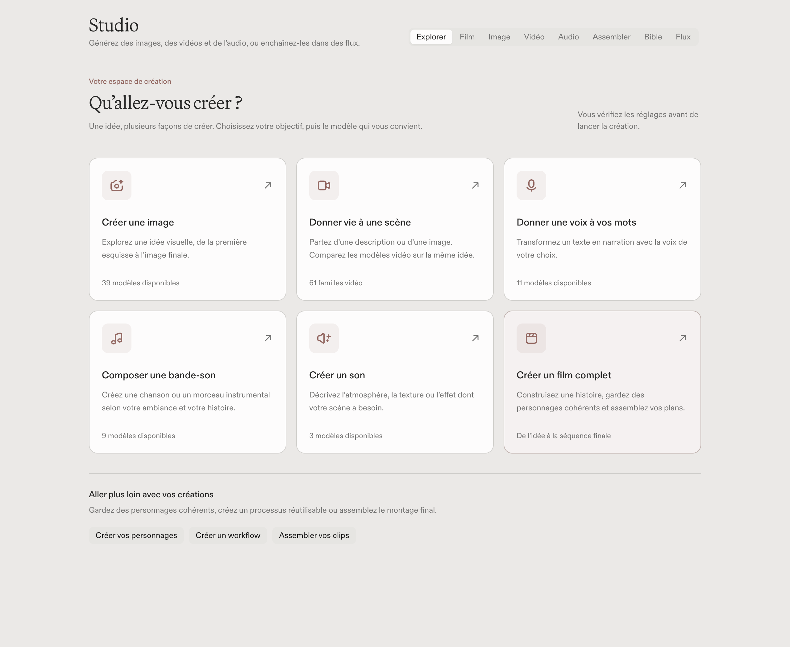
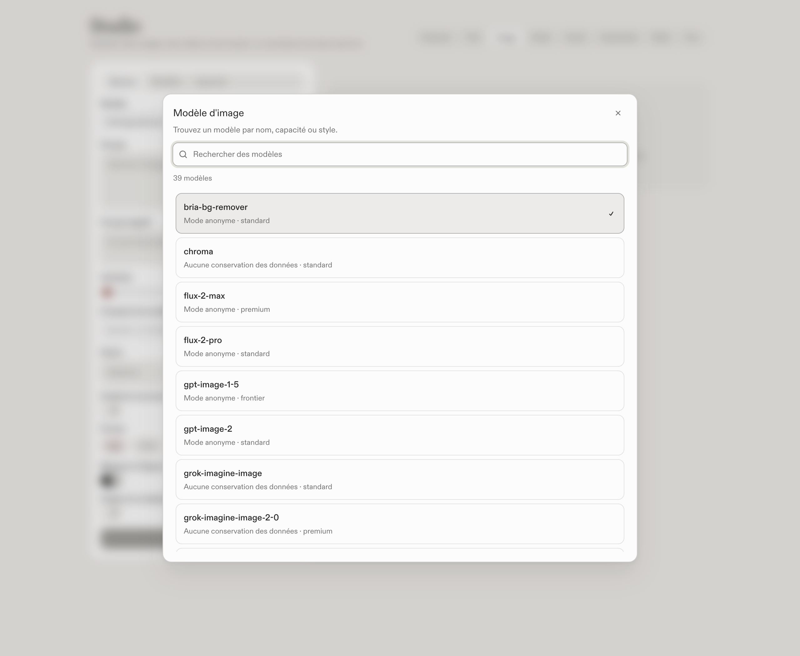
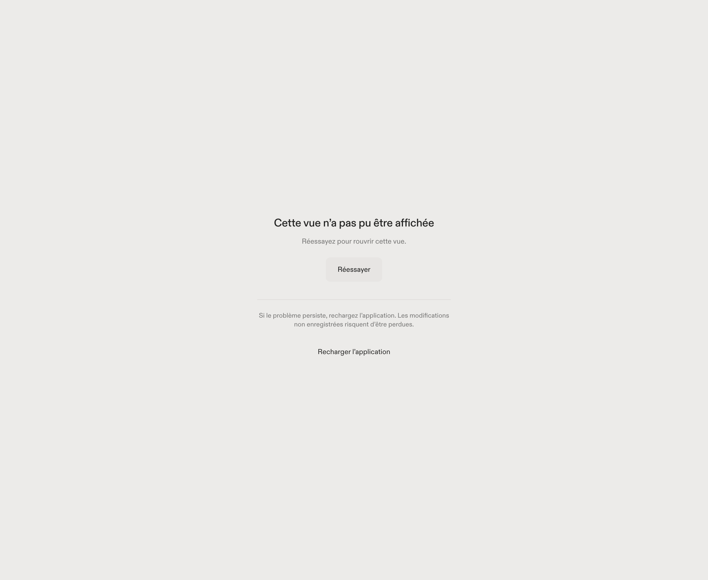
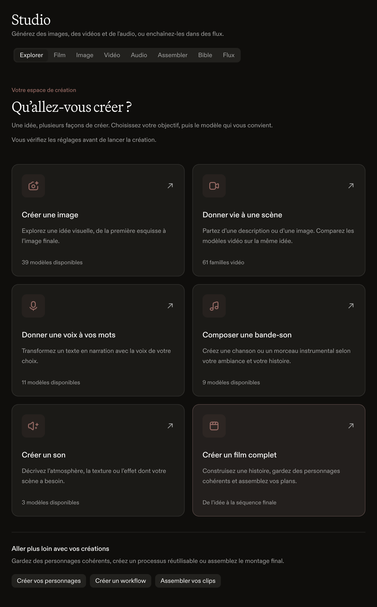
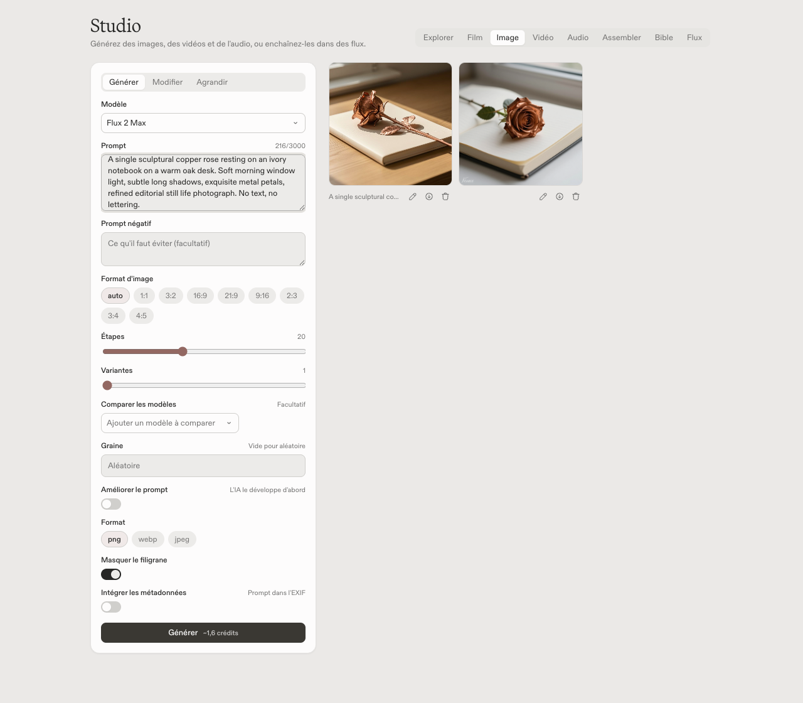

# Sub Rosa : préparation à la diffusion, 5 septembre 2026

Cette passe rend le catalogue créatif plus accessible, corrige les reprises de
session et ferme les lacunes de traduction repérées sur les deux interfaces.
Les essais payants décrits ci-dessous sont maintenant réalisés. Les paquets
signés et le partage sur iPhone physique restent à éprouver avant de certifier
la sortie.

## Comportements livrés

- Le Studio propose six points de départ : image, vidéo, narration, musique,
  bruitage et film. Les compteurs proviennent du catalogue chargé. Les ateliers
  et le dernier onglet choisi restent accessibles.
- Le choix du modèle devient une recherche dans le catalogue, avec les noms,
  variantes, contraintes et voix publiées. Un tarif inconnu reste inconnu ;
  un modèle explicitement hors ligne n’est pas réintroduit par le secours.
- Les écrans chargés à la demande et le démarrage proposent une reprise
  explicite. Un échec de chargement des notes ne se présente plus comme une
  bibliothèque vide. La première note n’est pas créée deux fois par StrictMode.
- Sur mobile, un échec d’envoi conserve le brouillon et les pièces jointes.
  Une ancienne réponse ne remplace plus l’état d’un nouveau tour. Une reprise
  native prend une propriété exclusive sur le tour et revérifie la ligne avant
  d’appeler le modèle. Après un redémarrage ayant perdu les pièces jointes, la
  session demande de les joindre à nouveau avant tout appel payant.
- Le contrôle de traduction couvre les branches conditionnelles, les chaînes
  de repli, les gabarits, le JSX et ses attributs dans tous les TSX livrés.
  L’audit a aussi corrigé des messages indirects de chat, de réglages et de
  mobile. Les exemples techniques restent des données. Ce contrôle syntaxique
  ne prouve pas à lui seul la traduction de toutes les fonctions auxiliaires.
- La politique de confidentialité explicite du catalogue prévaut sur les
  métadonnées contradictoires. Les descriptions attribuent les politiques au
  catalogue, sans promettre un chiffrement côté client non vérifié.
- Les nouveaux fichiers générés portent l’extension du format reçu, même si
  le fournisseur ignore le format demandé. La détection native fonctionne
  sur les réponses base64 et les téléchargements, avec 16 octets de mémoire
  de reconnaissance. Elle saute les métadonnées ID3 avant d’identifier un
  FLAC ; ID3 ne signifie pas MP3. Les octets sont conservés, sans conversion.
  Les FLAC restent audio lors de la reconstruction de la galerie et reçoivent
  le bon type MIME dans les lectures mobiles et les entrées des flux.
- Les estimations de crédits utilisent désormais la langue choisie :
  « 1,6 crédits » en français, avec le singulier approprié.
- Les deux cibles iOS ont l’App Group dans leurs entitlements et dans la
  configuration de génération XcodeGen. Le partage conserve ainsi son accès
  au même conteneur après régénération du projet.

## Vérifications

| Contrôle | Résultat |
| --- | --- |
| Vitest, `--maxWorkers=2` | 250 suites, 4 089 tests réussis, 2 ignorés |
| TypeScript et build Vite | Réussis ; avertissement de taille du chunk App conservé |
| Biome et son ratchet | Réussis ; 627 avertissements existants, contre 631 au départ |
| Rust natif, `cargo test --all-targets` | 985 tests réussis, 1 ignoré |
| Rust natif, `cargo clippy --all-targets -- -D warnings` | Réussi |
| iOS appareil et simulateur, `cargo check --lib` | Réussis ; 9 avertissements mobiles existants |
| Entitlements | XML valide ; tests du groupe partagé et des deux cibles XcodeGen réussis |
| `pnpm audit --prod` | Aucune vulnérabilité signalée pour les 102 dépendances analysées |
| `cargo audit` des deux lockfiles | Aucun avis bloquant selon la politique existante ; exception RSA documentée conservée, 16 avis de maintenance et 1 avis de sûreté côté natif |

Les dépendances et les seuils d’avertissement n’ont pas été modifiés. La seule
exception de taille retirée est celle de Sidebar, redevenu inférieur à 2 000
lignes après extraction de ses menus. Les assertions de confidentialité ont
été ajustées pour refuser l’ancienne priorité donnée aux métadonnées.
Le test de réindexation des passages fixe désormais son horloge de données :
son édition simulée du 5 septembre à 09:00 UTC était devenue antérieure à
l’indexation réelle pendant cette passe. Le comportement de production de la
recherche n’a pas changé.

## Vérification visuelle sans génération

Parcours dans les vrais composants React du Studio, avec un pont Tauri de test
et un instantané du catalogue public Carpe Diem du jour. Aucune génération
payante, aucune donnée personnelle ni clé dans ces captures. Le pont refuse
les commandes de génération ; ce parcours ne valide donc ni la facturation,
ni la qualité des modèles, ni le téléchargement d’un résultat réel.

Le parcours ouvre l’image, recherche Flux, ferme le choix au clavier, ouvre
directement la narration, recherche et choisit une famille vidéo, bascule le
thème et la largeur, puis provoque un échec de chargement et le reprend.
Aucune erreur JavaScript inattendue. Les captures ont été inspectées après
les animations d’ouverture.

## Essais réels avec le budget autorisé

Plafond autorisé : **500 crédits**. Les 11 lignes du journal correspondant aux
9 modèles testés totalisent **5,2151 crédits**. Le solde disponible a varié de
8,7053 crédits lors du dernier rapprochement : il comprend aussi les retenues
et l’activité du compte, donc cette différence n’est pas assimilée à une facture
d’essai. Le garde-fou local a réservé cumulativement 121,44 crédits de façon
conservatrice, y compris pour les requêtes refusées et les reprises de route.
Aucun nouvel achat pour reprendre une vidéo ou une musique en attente.

Les essais utilisent des prompts synthétiques et un conteneur de données QA
séparé de l’installation. La clé reste dans le processus natif. Le client de
chat utilise le sidecar construit depuis cette branche ; les médias passent
par les vraies commandes Rust de Carpe Diem (ADR-0008). Le pont de navigateur
remplace uniquement le transport IPC, pas les générations ni leur sauvegarde.
Ce dispositif ne remplace pas l’installation d’un paquet signé dans WKWebView.

| Parcours | Preuve obtenue |
| --- | --- |
| Chat, `qwen3-5-35b-a3b` et `qwen3-5-9b` | Deux tours avec appel d’outil structuré, arguments 19 et 23, résultat 42 puis réponse française ; terminaison SSE vérifiée |
| Image, `z-image-turbo` | PNG 1024 × 1024, 1 708 367 octets, sauvegardé puis inspecté |
| Image depuis le Studio, `flux-2-max` | Recherche, choix, saisie, génération et galerie réelle en 35 s ; aucune erreur JavaScript ; JPEG 1024 × 768 reçu malgré PNG demandé |
| Narration, `tts-kokoro`, voix `ff_siwis` | MP3 français, 7,728 s, 24 kHz mono, 31 149 octets |
| Transcription, `nvidia/parakeet-tdt-0.6b-v3` | Le MP3 passe par Symphonia et le sidecar ; le texte français est restitué, notamment « images » et « français » |
| Vidéo, `sora-2-text-to-video` | Ligne durable créée, processus fermé puis relancé, reprise et téléchargement natif ; MP4 1280 × 720, 4,1 s, 1 577 638 octets |
| Bruitage, `elevenlabs-sound-effects-v2` | File d’attente native puis téléchargement ; MP3 stéréo 44,1 kHz, 3,03 s, 48 945 octets |
| Musique, `ace-step-15` | Reprise du même travail après redémarrage ; récupération après 8 min 31 s ; FLAC stéréo 48 kHz, 60 s, 3 795 213 octets, précédé de métadonnées ID3 |

Les images et trois instants de la vidéo ont été inspectés. Le déplacement de
caméra est visible et la rose reste cohérente. Le résultat Z-Image comporte
un filigrane malgré `hide_watermark: true`, contrairement au résultat Flux
observé. Ces observations ne garantissent pas le comportement de tout le
catalogue. Les trois fichiers audio se décodent aussi dans Chromium, avec un signal
non silencieux. Les durées et formats audio sont vérifiés ; une appréciation
subjective de leur qualité d’écoute reste distincte de ces contrôles.

Le JPEG et le FLAC réels ont ensuite été rejoués **sans nouvel appel payant**
dans la sauvegarde native et un téléchargement HTTP découpé. Les extensions
corrigées sont `.jpg` et `.flac`, et les fichiers sont identiques octet par
octet. Les tests couvrent aussi les métadonnées ID3 réparties sur toutes les
tailles de fragments et leur pied optionnel, conformément à la
[structure ID3v2.4](https://id3.org/id3v2.4.0-structure).

## Ce qui conditionne encore une sortie

1. Produire et installer les paquets macOS signés, le paquet Windows et la version iOS
   sur appareil physique. Vérifier les mises à jour, les permissions audio et
   le partage depuis une autre application. Les compilations ne remplacent
   pas ces essais. Les deux profils iOS doivent autoriser l’App Group ; les
   étapes et secrets requis restent décrits dans `HANDOFF.md`.
2. Confirmer les droits de redistribution des cinq polices déjà présentes
   dans `public/`. La provenance de leur licence n’est pas documentée dans
   ce dépôt ; cela ne démontre pas une absence de licence.
3. Éprouver les productions longues et les suspensions sur iPhone réel.
   Les reprises natives testées ici sont des redémarrages de processus QA sur
   macOS, pas des suspensions iOS. Neuf modèles exercés ne certifient pas les
   344 entrées du catalogue chargé, ni une latence constante du fournisseur.

Cette branche ne nécessite aucun déploiement d’un backend hébergé. Elle ne
publie pas de version et ne modifie pas les données de l’installation locale.
